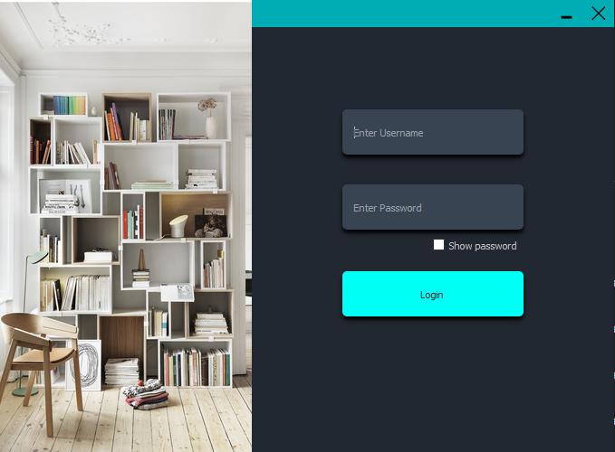
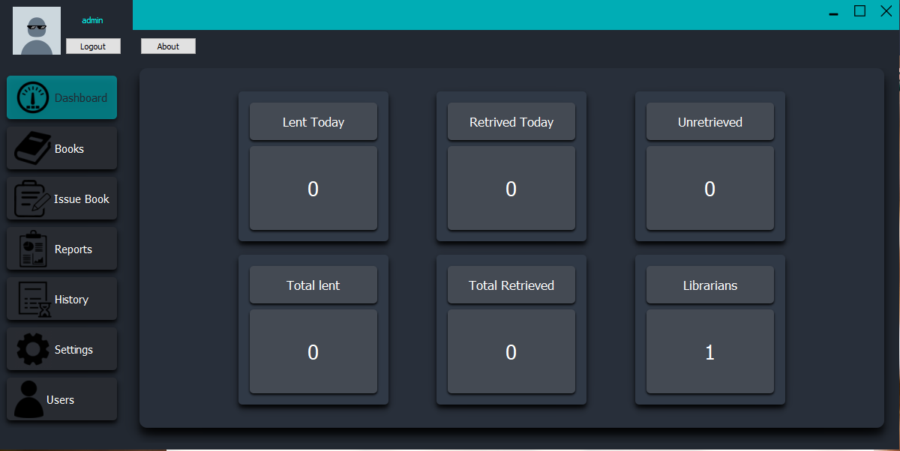

# School_Library_System

## How to setup up

1. Install Python3.9.x
2. Open a terminal in the directory 'requirements.txt' is located.
3. run 'pip install -r requirements.txt' in the terminal.

If you have any trouble setting it up or any suggestions to improve this project feel free to let me know.

## Default login credentials

**username** : admin
**password** : admin

## Login Window

## Dashboard Window

